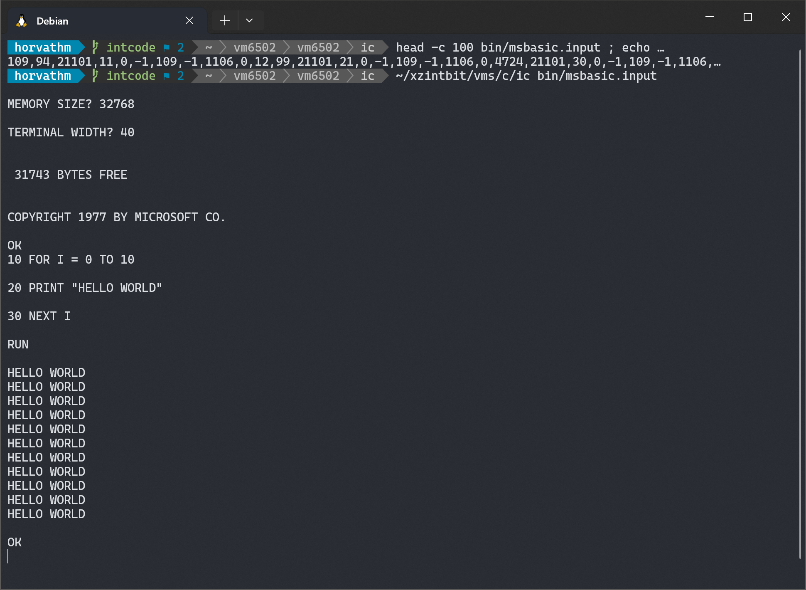

# VM6502

VM6502 is a simple virtual nachine emulating the MOS 6502 processor, capable of running Microsoft Basic

Q: Where do I get the Microsoft Basic binary to run?  
A: Here https://github.com/matushorvath/msbasic. Compile it and use the `vm6502.bin` variant.

Q: How do I run the image?  
A: `$ node js/main.mjs --load c000 ../msbasic/tmp/vm6502.bin`

Q: How complete is the emulation?  
A: All officially documented instructions are emulated. The virtual machine passes [6502 functional tests](https://github.com/amb5l/6502_65C02_functional_tests).

Q: Why?  
A: Just for fun.
