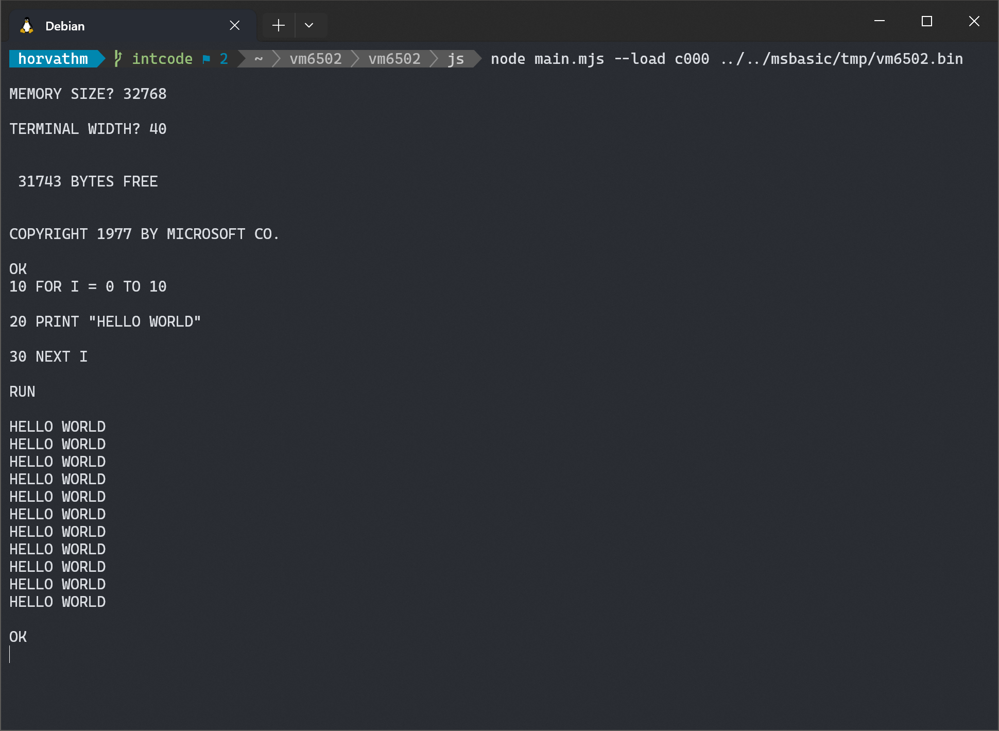

<div align="right"></div>

# Microsoft Basic on an Intcode Runtime

VM6502 is a simple virtual nachine emulating the MOS 6502 processor, capable of running Microsoft Basic.
There are two implementations of VM6502 in this repository: one in JavaScript and one in [Intcode](https://esolangs.org/wiki/Intcode).

## Intcode

The Intcode version of the 6502 emulator is written in Intcode assembly, which is a language that can be translated
into raw Intcode using my [xzintbit](https://github.com/matushorvath/xzintbit) Intcode assembler and linker.
(The assembler and linker are also written in Intcode, by the way, and are self-hosting.)


You can try to run Microsoft Basic on an Intcode runtime yourself:
1. Clone and build the [xzintbit](https://github.com/matushorvath/xzintbit) repository.
   Please see the documentation in that repository.
   You can either use your own Intcode runtime, or use one of the runtimes in the xzintbit repository.
1. Clone and build the [msbasic](https://github.com/matushorvath/msbasic) repository,
   which is a slightly modified Microsoft Basic version that can run on an emulated 6502.
1. Clone the [functional tests](https://github.com/Klaus2m5/6502_65C02_functional_tests) repository (no need to build it).
1. Build the intcode image. Assuming the paths were these three repositories are cloned:
   ```sh
   $ ICDIR=~/xzintbit MSBASICDIR=~/msbasic FUNCTESTDIR=~/6502_65C02_functional_tests make test
   ```
1. Execute the built image:
   ```sh
   $ ~/xzintbit/vms/c/ic bin/msbasic.input
   ```

## JavaScript

The JavaScript version of the 6502 emulator was really a proof of concept. Before diving into Intcode, I wanted to
proof I can write a working 6502 emulator in a more sane programming language.



You can also run the Microsoft Basic using the JavaScript VM6502:  
```sh
$ node js/main.mjs --load c000 ~/msbasic/tmp/vm6502.bin
```

## Q & A

Q: How complete is the emulation?  
A: All officially documented instructions are emulated. The virtual machine passes [6502 functional tests](https://github.com/amb5l/6502_65C02_functional_tests).

Q: Why?  
A: Just for fun.
